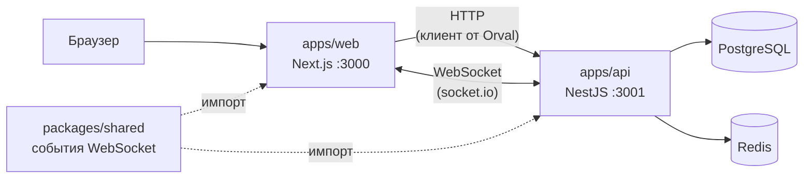

# Архитектура монорепы

[← к документации](./README.md)

Командный мессенджер: чаты, канбан-задачи, интеграция с GitHub, ИИ-ассистент. Внутреннее устройство фронтенда
(FSD, слои) — в [`apps/web/docs/architecture.md`](../apps/web/docs/architecture.md).

## Части проекта

```
monorepo-app/
├── apps/web          # фронтенд: Next.js 16, React 19, FSD            → :3000
├── apps/api          # бэкенд: NestJS 12 (ESM)                         → :3001
├── packages/shared   # @app/shared: zod-схемы, типы, события сокетов — общие для web и api
├── docs/             # документация всего проекта (вы здесь)
├── AGENTS.md         # правила для ИИ-агентов (+ AGENTS.md в каждом пакете)
└── .github/          # CI и шаблон PR
```

- **pnpm workspaces** связывают пакеты: `"@app/shared": "workspace:^"` — ссылка на папку, а не пакет из npm.
  Изменили `packages/shared` — оба приложения видят изменения сразу.
- **Turborepo** запускает задачи (`dev`, `build`, `lint`, `typecheck`) во всех пакетах и кэширует результат.
- `@app/shared` отдаёт исходники TypeScript без сборки; во фронтенде он указан в `transpilePackages`.

## Как всё связано


```mermaid
flowchart LR
    Browser["Браузер"] --> Web["apps/web<br/>Next.js :3000"]
    Web -- "HTTP<br/>(клиент от Orval)" --> API["apps/api<br/>NestJS :3001"]
    Web <-- "WebSocket<br/>(socket.io)" --> API
    API --> PG[("PostgreSQL")]
    API --> Redis[("Redis")]
    Shared["packages/shared<br/>события WebSocket"] -. "импорт" .-> Web
    Shared -. "импорт" .-> API
```

PostgreSQL подключён к бэкенду через Drizzle ([ADR-0012](./adr/0012-orm-drizzle.md),
[README API](../apps/api/README.md#база-данных)), таблиц пока нет. Redis и WebSocket ещё не подключены — это план, а
не текущее состояние.
Локальные PostgreSQL и Redis запускаются через Docker Compose; приложения работают на компьютере разработчика.
Инструкция — в [корневом README](../README.md#локальные-postgresql-и-redis),
решение и его причины — в [ADR-0010](./adr/0010-local-infrastructure.md).

Общий dev-стенд имеет отдельную конфигурацию в `deploy/dev/`: готовый образ API, PostgreSQL, Redis и Nginx.
Секреты и TLS-ключи передаются с сервера, данные сохраняются в volumes. Структура и выбор proxy —
[ADR-0013](./adr/0013-shared-dev-environment.md), запуск и ограничения — [инструкция](../deploy/README.md).

## Контракт фронтенд ↔ бэкенд

Решение и его причины — [ADR-0009](./adr/0009-api-contract-openapi-orval.md).

- **HTTP — OpenAPI от бэкенда + Orval.** DTO (описание запросов и ответов) — Zod-схемы в `apps/api`, не модели
  Drizzle. Из них `@nestjs/swagger` строит схему, она лежит файлом `apps/api/openapi.json` в репозитории, а фронтенд
  генерирует из неё типы, хуки TanStack Query и Zod-схемы для форм: `pnpm --filter web generate-api` →
  `apps/web/src/shared/api/generated/`. HTTP-схем руками на фронтенде и в `@app/shared` не пишем.
- **WebSocket — `@app/shared`.** Swagger не описывает события socket.io, поэтому их названия и Zod-схемы данных
  лежат в общем пакете и импортируются обеими сторонами.
- **Все HTTP-пути бэкенда начинаются с `/api`**, версии в пути нет. Бэкенд разрешает CORS только для адреса из
  `CORS_ORIGIN`.

Swagger UI — `/api/docs` на запущенном бэкенде, а файл `apps/api/openapi.json` пишет команда `pnpm --filter api openapi`
без запуска сервера; Orval генерирует клиент из этого файла. CI пересоздаёт файл и клиент и падает, если они отличаются
от закоммиченных. Эндпоинты, которые нужны фронтенду, описываем в задаче Jira (метод, путь, запрос, ответ, ошибки)
**до** начала работы, а пока эндпоинта нет — фронтенд работает на моках MSW (`apps/web/src/shared/api/mocks/`).

Изменение контракта — всегда изменение для обеих сторон: в одном PR обновляются `apps/api`, `apps/web` и (для
событий WebSocket) `packages/shared`, в описании PR указано, совместимо ли оно назад. Код такого PR ревьюит второй
бэкендер, а контракт — фронтендер, который будет его использовать: отметьте его в PR.

## Авторизация

Способ входа и хранения сессии **ещё не выбран** — решение будет оформлено ADR. Код входа в
`apps/web/src/features/auth` (кнопки Google/GitHub, формы) — заготовка из шаблона, а не принятый контракт: не
стройте под него бэкенд, пока нет ADR. Что нужно решить — [docs/backlog/auth.md](./backlog/auth.md).

## Переменные окружения

| Где                   | Кто читает                             | Шаблон                                              |
| --------------------- | -------------------------------------- | --------------------------------------------------- |
| `.env` в корне        | Docker Compose и API (`ConfigModule`)  | [`.env.example`](../.env.example)                   |
| `apps/web/.env.local` | Next.js (читает только из своей папки) | [`apps/web/.env.example`](../apps/web/.env.example) |

Подготовка файлов окружения и запуск инфраструктуры — в [корневом README](../README.md#настройка-окружения-env).
Переменные API, их значения по умолчанию, приоритет и загрузка при запуске —
в [README API](../apps/api/README.md#переменные-окружения).

`.env*` в git не коммитим, шаблоны `.env.example` — коммитим. Подробно — [Процесс работы](./workflow.md#секреты-и-переменные-окружения).

## Проверки

| Где                   | Команда                                            |
| --------------------- | -------------------------------------------------- |
| Вся монорепа (как CI) | `pnpm typecheck && pnpm lint && pnpm build`        |
| Фронтенд              | `pnpm --filter web verify`                         |
| Бэкенд                | `pnpm --filter api lint && pnpm --filter api test` |

CI (`.github/workflows/ci.yml`) пока запускает только typecheck, lint, build и проверку контракта API — тестов и
Prettier в нём нет. Подробнее — [`apps/web/docs/tooling.md`](../apps/web/docs/tooling.md#ci).
